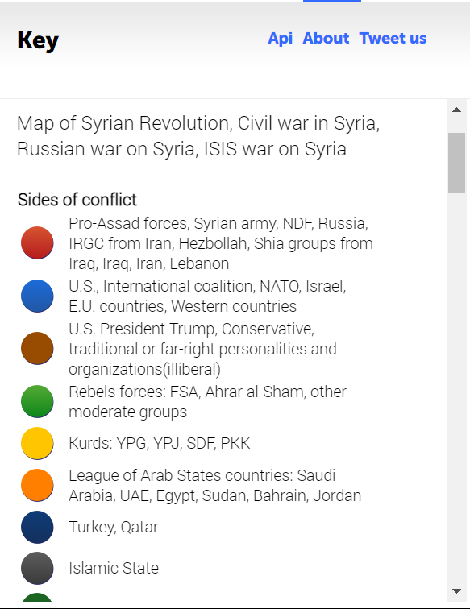
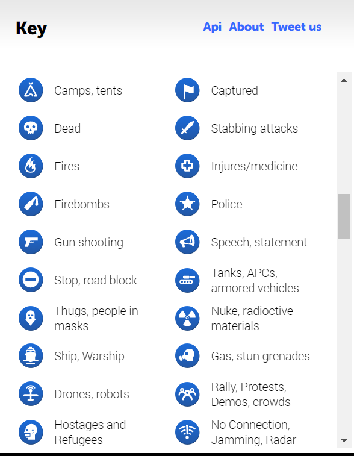
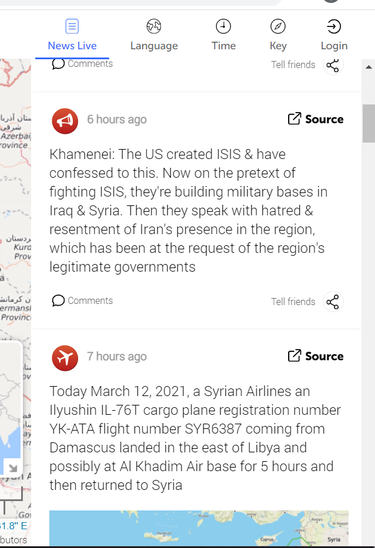

 Throughout this quarter, we have learned about the great variety of aspects that go into understanding maps as well as making them. In the article "Critical Atlas of the Internet," we read about the different ways of visualizing the totality of the Internet. Over the course of many iterations of sketches and designs followed by explanations and rationales for them, we got to experience the process of creating meaningful visualizations. Articles like "Intro into Critical Cartography" and "Putting Data back into Context" teach us to pay attention to the underlying assumptions and motivations of the maps that we read. These papers place great emphasis on the fact that maps are not objective models of information and the need to regard them as forms of argumentation. Additionally, articles like "Can social media clear the air?" and the Anti-Eviction Mapping Project were great examples to showcase how maps can be utilized to display inequities in access and opportunity for different groups of people. In this way, maps can be a really good medium to document and display social injustices that need attention. Because of all these different aspects that it takes to make good maps, for a while it seemed like it would be difficult to find a mapping project that could excel in a variety of key aspects. Fortunately, that was not the case at all. I learned about the existence of the Live Universal Awareness Map, also  known as Liveuamap, to be an independent global news web mapping project that is not only reliable in the information it presents while in nearly real-time and documenting meaningful events for serious global conflicts such as the  Syrian civil war, Israel-Palestine conflict, Ukranian conflict, and many more.

 For the purposes of this paper, we are going to focus on the Liveuamap digital map for the Syrian civil war because each and ever project has its own features and pieces that could be examined in detail. Liveuamap, as a mapping project, was developed by engineers and journalists who were interested in presenting information to the world about the conflict going on in Ukraine in 2014. Since then, they have expanded the range of the topics being covered by popular demand. Liveuamap's influence has extended to the point where it now provides also provides data for the organization Doctors Without Borders and works with governments all over the world to provide data and ensure the security of citizens and diplomatic missions. In the case of the Syrian civil war digital map, it seems to be regarded overall as a useful source of information despite some sourcing quality inconsistencies by the United Nations Department of Political and Peacebuilding Affairs as well as the Centre for Humanitarian Dialogue. In a digital toolkit report by the UN, Liveuamap is regarded as a useful digital tool currently being used by mediators.

 >"In Syria, HD uses Liveuamap as a credible source of information to maintain an overview of developments. Information of interest is then verified by HD’s network of contacts."

>"HD also uses the tool to contribute to ensuring the security of its staff when travelling to Syria."

 >"LiveUA is useful for DPPA in that it quickly highlights ground incidents reported on social media, and its mapping and (rough) geotagging are helpful references. However, the accuracy of the information and geolocation it conveys varies significantly (in part due to inconsistent quality of sourcing), and thus must be verified through other channels."

 Furthermore, Liveuamap has also partnered with the Armed Conflict Location and Event Data Project (ACLED) to provide data about Syria in what is being called the Syria Partner Network, dedicated towards productive collaboration of organizations at the local, national, and international levels and ensuring data on the Syrian conflict is of high quality. Based on the number of organizations and institutions that Liveuamap works with, it is pretty clear that this project intends to provide reliable information to an audience of people who are living/ working in the area in order to ensure that they are up to date on what is going on in order to stay safe. This is why there is an emphasis on how quickly markers are sourced, curated, and posted onto the map. Additionally, due to the fact that this conflict is a matter of international interest as well, the digital maps are translated into 8 different languages: English, Spanish, French, Dutch, Turkish, Ukrainian, Russian, and Arabic. On the other hand, this map isn't only for those who are already familiar with what is going on; there is a key information tab in the legend that provides a little bit of background information on the different sides at play and which countries/ institutions are supporting which areas. Overall, it seems that this map is intended for anyone who wishes to learn about the Syrian civil war, and it offers nearly real-time updates about critical events for those who need to have the most up-to-date information about what's going on while also providing general information for people who aren't as knowledgeable about the war.

 When it comes to the technical features of the digital map, Liveuamap is certainly not short on useful options. Upon loading, you are focused on a map of Syria painted in different colors and a large amount of markers around the area. The map is interactive and developed on Leaflet libraries. In the top left of the map, there is a menu to switch to different digital maps. The four most popular ones seem to be maps for the United States, Ukraine, Syria, Iraq, and the region of Caucasus. To find the rest of the Livuamaps, you can select from numerous regions and topics throughout the world. The maps themselves are pretty intuitive to understand. The basemaps are sourced from OpenStreetMaps, and they find the right balance of providing the names of important locations in the region while also not being too detailed or distracting. In the map of Syria, you will find the state divided into a series of distinct colors, which you can then go over to the key tab to find the legend that explains which areas are controlled/ supported by which sides. Additionally, the markers are color coded in the same pattern as the land, so you can determine what factions the marker will be about. The nature of the different markers can vary greatly, and so the legend for the markers includes descriptions for roughly 60-80 different types of events. Events can range from shootings, to landmine explosions, to events relating to warships, trucks, military bases, police, and much, much more. These markers can be selected and deselected to cater towards the interests of the viewer. The edges of the map provide a variety of different features as well. There is an option to change the basemap into satellite mode, but is only available in the pro version. You can toggle the event markers, and draw lines and polygons on the map. The bottom right offers a north arrow, a scale bar, coordinates, and a minimap to provide additional context of where the map is focused on.

 
 
 

 One of the most important and unique aspects of this digital map is the news feed that covers the right side of the screen at all times. Here, you can find descriptions for each and every event marker that is on the map, and a link is provided to the source of the news events. Stories are updated throughout the day, so these events are often sourced and curated within a matter of hours. There is an option available to pro version users that allows you make requests for news events through an api. Additionally, there is a timeline where you can select the dates from which you want to load the event markers for the map. This timelines is very detailed as well, it includes every single day for the last 3 years, and each day has an average of at least a couple dozen newsworthy events.

 

 Another strength of Liveuamap is the amount of effort they have gone through to make their maps as accessible as possible for as many people as possible. This is evident from the emphasis they put on the availability of the free mobile app that can be downloaded. This is likely why they have used Leaflet to develop their maps off of, because of the ease with which these maps can be used on smart phones. Another way in which they try to make this information as easy to access is through their large social media presence. Underneath the about page, you can find the list of social media accounts that they have, and the list is not short, they have multiple accounts for Facebook, Telegram, Twitter, all in different languages in order to appeal to their international audience. It is clear that Liveuamap prioritizes the sharing of news to people by any means.

 Overall, I think that Liveuamap is a great example of the ability of the powers that a well-developed digital map can provide to the education of people. Liveuamap has found the right balance of being useful to people are already familiar with conflicts in the area while also user-friendly to people are not as familiar with the issues of the region. Furthermore, Liveuamap places a large amount of emphasis on being timely in terms of the reporting of its news, and it seems to be reliable enough that it is considered a useful tool by large international organizations like the UN DPPA and HD. Last, but not least, the map itself is incredibly easy quick to load and respond to user input, and it also provides an assortment of helpful options and tools that users can interact with the tailor the map to their needs.
